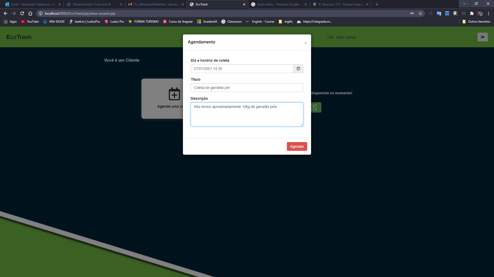
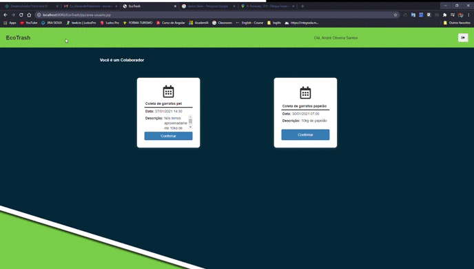

# EcoTrash
Projeto avaliativo da faculdade que tinha como requisito utilizar a
tecnologia aprendida no semestre que foi Java Web com JSP e Servlet.

O objetivo do projeto foi gerar valor de alguma forma para as pessoas, e principalmente para ao meio ambiente. Então, foi desenvolvido o EcoTrash um site web, onde pessoas achariam pessoas dispostas a coletar seu lixo ecológico, e assim tirar alguma renda desse serviço. 

## Área do cliente

Criando um agendamento de remoção de lixo

 

## Área do coletador
Confirmando uma retirada

