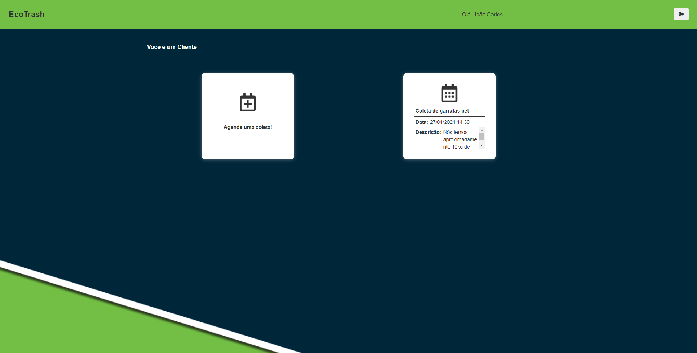
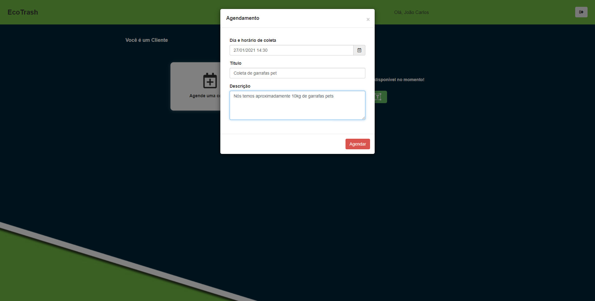

# EcoTrash
This is a university assessment project that required the use of the technologies learned during the semester, specifically Java Web with JSP and Servlets.

The goal of the project was to generate value for people, with a particular focus on environmental sustainability. To achieve this, EcoTrash was developed as a web platform where individuals can find people willing to collect recyclable waste, allowing them to properly dispose of their waste while enabling others to generate income through this service.

## Customer Portal

Schedule Waste Collection

 

## Worker Area
Pickup Confirmed

